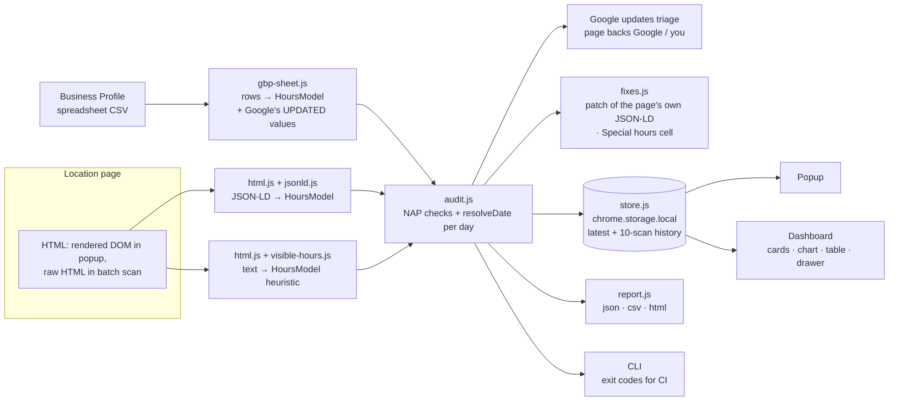

# Location Drift Inspector

[](tests/)
[](package.json)
[](LICENSE)
[](extension/manifest.json)

**A Chrome extension and CLI that checks, day by day, whether each location page on your website says the same thing as your Google Business Profile spreadsheet, tells you which of Google's pending edits your own page is backing, and writes non-destructive fixes in both directions.**

```text
Mockup (describes the real UI; there are no image files in this repo)

POPUP (click the toolbar button on a location page)
┌ Location Drift Inspector ─────────────────────── [Dashboard] ┐
│ [FAIL] NG-KENS · Northgate Rentals Kensington                 │
│ https://…/locations/kensington                                │
│ ┌──────────┐ ┌──────────┐ ┌──────────────┐                    │
│ │ 4 fails  │ │ 3 warns  │ │ 9/45 drift d │                    │
│ └──────────┘ └──────────┘ └──────────────┘                    │
│ NEXT 14 DAYS · PROFILE VS JSON-LD   ■■■■■■■■■■■■■■ green/red  │
│ FAIL phone: Telephone differs: profile 403-555-0120 vs …      │
│ FAIL google updates: 1 pending Google update is backed by …   │
│ WARN …                                                        │
│ The patch keeps 4 existing properties and changes only: …     │
│ [Copy patched JSON-LD] [Copy Special hours cell (+3)]         │
└───────────────────────────────────────────────────────────────┘

DASHBOARD (extension options page)
 sidebar: Locations · Import spreadsheet · Pages & settings
 top bar: As of [date] · [Scan all pages] · [Export ▾ json/csv/special-hours/html]
 cards:   locations in sheet · scanned · with a fail · drift days
 chart:   one bar per store code, 0…45 days (thick = vs JSON-LD, thin = vs page text, "n/a" = nothing to compare)
 table:   sortable, filterable — store code · name · status chip · fails · warnings · drift days · page
 drawer:  click a row → 45-day calendar, every finding, Google's pending updates with a verdict per field,
          the page's own JSON-LD block patched (list of changes + properties kept), Special hours cell,
          last 10 scans
```

## The Problem

Multi-location businesses keep the same facts — hours, holiday hours, phone, address — in two places that are edited by different people: the Business Profile and the location pages on their own website. The two drift apart, and Google treats the website as evidence.

- **Google uses your website to decide what your profile says.** Google's help page on suggested edits says edits you do not review within 4 days *may* be published automatically *"if it is supported by other publicly available information, such as your business website"* ([support.google.com/business/answer/3480441](https://support.google.com/business/answer/3480441)). The 4-day wording was added to that page in September 2026 ([Search Engine Roundtable](https://www.seroundtable.com/google-business-profiles-4-days-42139.html)); it says "may", not "will", and it is about the edits Google notifies you of. Its sourcing page lists *"crawled web content (e.g., information from a business' official website)"* as a source of profile information ([answer/2721884](https://support.google.com/business/answer/2721884)). Local-search practitioners describe the same mechanism for hours specifically ([Sterling Sky](https://www.sterlingsky.ca/google-keeps-updating-changing-listing/)).
- **Mismatches are common, and hours are the most common one.** DreamHost compared Google listings with the websites of 230 local businesses and found that 53% had at least one missing or mismatched detail; by field: hours 27%, phone number 18%, website 16%, address 11% ([DreamHost, updated 2026-08-26](https://www.dreamhost.com/blog/google-business-profile/)). Read it with its scope: a hosting company's study of independent businesses that excluded national chains and did not look at holiday hours, so it says nothing directly about multi-location brands. It is the best public number found, not proof about your locations.
- **Google already tells you what it wants to change.** A Business Profile download made with "Include Google updates" puts Google's proposed value next to yours, in columns such as *"[UPDATED] Sunday hours"*, and marks removals with *"[DELETED]"* ([answer/3478406](https://support.google.com/business/answer/3478406)). Whether your own location page agrees with Google or with you is exactly what decides whether an edit is "supported", and nothing compares the two.
- **Holiday hours are where it breaks.** Special hours live in a separate spreadsheet column (`YYYY-MM-DD: HH:MM-HH:MM`, `x` for closed — [answer/6303076](https://support.google.com/business/answer/6303076)), and on the website they live in date-scoped `openingHoursSpecification` entries or plain text. Nothing compares the two per date.
- **The two formats disagree about midnight.** In the Business Profile spreadsheet `00:00-00:00` (or `00:00-24:00`) means *open 24 hours*, while `x` or an empty cell means closed ([answer/3370250](https://support.google.com/business/answer/3370250)). In Google's documented convention for LocalBusiness structured data, opens `00:00` + closes `00:00` means *closed all day* and `00:00`–`23:59` means open 24 hours ([developers.google.com](https://developers.google.com/search/docs/appearance/structured-data/local-business)). Copying one into the other silently inverts the hours.

## The Solution

Export your locations from Business Profile Manager once. The extension keeps that spreadsheet as the intended truth (keyed by store code) and, for every location page:

1. reads the page's LocalBusiness JSON-LD (`openingHoursSpecification`, `specialOpeningHoursSpecification` and the text property `openingHours`) **and** its visible text,
2. resolves what each source says the location's hours are on **every date** of the next 45 days (special hours → date-scoped rules → weekly hours),
3. compares name, phone, address, URL and the date-by-date hours, and checks the page against itself,
4. if your download includes Google updates, sorts each pending update into *your page backs Google* (accept it or fix the page) or *your page backs you* (reject it),
5. hands you the fix: the page's **own** JSON-LD block with only the hours (and a drifted phone or address part) replaced, or a `Special hours` cell (and a two-column import CSV) for the profile.

Use the **popup** on the page you are looking at, the **dashboard** to scan all pages at once, or the **CLI** in a scheduled job.

## How this differs

Closest tools found in the prior-art check (2026-10-01):

| Tool | What it does | What it does not do |
|---|---|---|
| [GMB Everywhere](https://www.gmbeverywhere.com/) (Chrome extension) | Audits public Business Profiles on Google Maps; its feature list includes a "Website Audit (Website vs GBP)" that checks "NAP match, hours, categories, meta tags, content and click-to-call against the GBP". | Works one public listing at a time from Maps. Its published feature list does not describe date-level special-hours comparison, spreadsheet input for many locations, or generating fixes. |
| [dreadmoreeee/local-business-schema](https://github.com/dreadmoreeee/local-business-schema) (Python CLI, MIT) | Generates LocalBusiness JSON-LD; checks markup against Google's properties and compares NAP in markup with visible text across pages. | Has no Business Profile data to compare against and does not compare hours by date. |
| [ert93333-ops/local-business-hours-drift-qa-briefs](https://github.com/ert93333-ops/local-business-hours-drift-qa-briefs) | Browser page that turns pasted JSON-LD and notes into a QA checklist brief. | Its README states "No live crawl", "No page fetching", "No Google Business Profile API" — it does not compute a comparison. |
| Google Rich Results Test / Schema Markup Validator | Validate that markup is well-formed and eligible. | Do not know what your profile says, so a valid block with the wrong hours passes. |

Enterprise listing platforms (Yext, Uberall and similar) avoid drift by generating location pages and listings from one database; they solve it if you move your pages onto them, which teams with their own CMS often cannot.

This project's core is the part none of the tools above do: **the owner's own multi-location spreadsheet vs. each page, resolved per calendar date, Google's pending updates triaged against the page, the 00:00 semantics handled, and fixes that patch rather than replace.**

## Features

- **Business Profile spreadsheet import**: CSV from Business Profile Manager; store code / business code, name, address lines, locality, administrative area, postal code, primary + additional phones, website, one column per weekday (`Sunday hours` … `Saturday hours`) and `Special hours`. Unreadable cells are reported per cell, never guessed. (`extension/lib/gbp-sheet.js`)
- **Google's pending updates, triaged**: the `[UPDATED] …` columns of a download made with "Include Google updates" (weekday hours, special hours, primary phone, name, website, postal code, locality; `[DELETED]` included) are compared with the page. Each update gets a verdict and an action, in the dashboard, `report.html` and `google-updates.csv`. (`readGoogleUpdates` in `gbp-sheet.js`, `triageGoogleUpdates` in `audit.js`)
- **Date-by-date hours comparison**: every source becomes the same model; each date in the window is resolved (dated rules first, then weekly hours) and compared to the minute. (`extension/lib/hours.js`, `extension/lib/audit.js`)
- **Every common way a page states hours**: `openingHoursSpecification` (Google's documented property, incl. `@graph`, arrays, subtypes such as RealEstateAgent or Dentist), `specialOpeningHoursSpecification`, the text property `openingHours` (`Mo-Fr 09:00-17:00`, `Tu,Th 16:00-20:00`, `Mo-Su`), visible text and `tel:` links. (`extension/lib/jsonld.js`, `extension/lib/visible-hours.js`, `extension/lib/html.js`)
- **The page checked against itself**: JSON-LD hours vs the visible text, and `openingHoursSpecification` vs `openingHours`, whatever the profile says (`PAGE_CONSISTENCY`).
- **The 00:00 trap, named**: a JSON-LD day that reads "closed" where the profile says "open 24 hours" is reported as the opposite-semantics mistake it usually is.
- **Holidays worded by who said what**: a dated rule on the page that contradicts the profile is a fail (`SPECIAL_SCHEMA`); a profile holiday the page never declares is a warning that the page's regular hours apply that day (`SPECIAL_UNDECLARED`).
- **NAP checks**: name, primary vs additional phone, address by component (street, locality, region, postal code) with abbreviation and province/state normalisation, profile Website vs page URL, JSON-LD `url` vs page URL. (`extension/lib/normalize.js`)
- **Non-destructive fix for the website**: the page's own JSON-LD block, copied, with only `openingHoursSpecification` replaced (and the telephone or address parts that drifted). Ratings, reviews, images, `geo`, `sameAs`, `@id` and every other node in the `@graph` are kept, and the fix lists what it changed and what it kept. It carries every future profile holiday, not only those inside the window, and keeps future holidays that only the page declares (the profile may be the side missing them). Tests prove the patched block resolves to the profile's hours, and that patch plus Special hours cell together leave zero drift. (`patchLocalBusinessJsonLd` in `extension/lib/fixes.js`)
- **Fix for the profile**: a `Special hours` cell for dates the website announces but the profile lacks, keeping the profile's existing special dates and splitting sets that pass midnight as Google's help page requires; exported for all locations as `special-hours.csv` (`Store code,Special hours`).
- **Popup, dashboard and CLI**: the popup checks the rendered page in the current tab and leaves the fail count on the toolbar badge; the dashboard batch-scans every location page with cards, drift chart, sortable table, detail drawer and the last 10 scans; the CLI runs the same engine in a scheduled job and exits 1 when a location fails (`--fail-on fail|warn|never`). (`extension/popup/`, `extension/dashboard/`, `bin/drift-inspector.mjs`)
- **Exports and packaging**: `report.json`, `findings.csv`, `special-hours.csv`, `google-updates.csv` and a standalone `report.html`. The toolbar icon is drawn from code (`extension/lib/icon.js`), and `npm run package` writes a store-ready copy with PNG icons. Data stays in `chrome.storage.local`; the only network requests are to the pages you scan.

### How the numbers are computed

- **Drift days** = the number of dates in the window on which the profile's hours and the page's JSON-LD hours are both known and differ. **Compared days** = the dates on which both are known. "9/45" means 9 of 45 compared days differ; "0/0" means the page has no JSON-LD hours, so nothing could be compared (shown as *n/a* in the chart — never as zero drift). The same two numbers are computed against the visible text.
- **Fails** = checks where the profile and the JSON-LD make two explicit, contradictory statements (or a spreadsheet cell cannot be read), plus pending Google updates that the page backs. **Warnings** = something missing on the page (including an undeclared holiday), a contradiction with the visible text (the text reader is heuristic, so it never produces a fail), a page that contradicts itself, or a pending update the page cannot settle. A location's status is `fail` if it has any fail, else `warn` if it has any warning, else `pass`.
- **Google update verdicts**, per pending field: `page-backs-google` = the page equals Google's proposed value and not yours; `page-backs-profile` = the page equals your value; `page-silent` = the page does not state the field; `page-differs` = the page shows a third value. A `[DELETED]` hours cell means Google thinks the location is closed that day.

## Architecture



Trade-offs:

- **No build step, plain ES modules.** The same files run in the popup, the dashboard, the service worker and Node tests. The cost is no TypeScript; JSDoc and 62 tests carry the contracts instead.
- **Patch, never rebuild.** A rebuilt LocalBusiness block is simpler to generate but deletes whatever the site's SEO plugin or developer added (reviews, ratings, images, `geo`, `sameAs`). In a test run on 2026-10-04 against four real dental-clinic sites in Calgary, a rebuilt block would have dropped between 7 and 14 properties per site. The patch copies the block and touches only the fields the audit found wrong.
- **String parsing instead of a DOM.** The service worker has no `DOMParser`, and Node tests should not need jsdom. The cost: text hidden with CSS is treated as visible.
- **Spreadsheet, not API.** The CSV export needs no OAuth or API approval and is what multi-location teams already edit, and with "Include Google updates" it also carries Google's pending changes. The cost: it is a snapshot from the moment you downloaded it (see Limitations).
- **Visible text can only warn.** Free text is written too many ways for a reader to be certain, so it is reported with a lower severity than the machine-readable JSON-LD.

## Tech Stack

JavaScript (ES2022 modules) · Chrome Manifest V3 (service worker, `activeTab`, `scripting`, `storage`, optional host permissions) · HTML + CSS design tokens · inline SVG chart · Node.js ≥ 18.18 for the CLI and tests (`node:test`, no runtime dependencies) · ESLint 9.

## Installation

```bash
git clone https://github.com/mehranmoghadasi/location-drift-inspector.git
cd location-drift-inspector
npm install          # dev tools only (ESLint); the extension and CLI have no runtime dependencies
npm test
```

Load the extension: open `chrome://extensions`, switch on **Developer mode**, click **Load unpacked** and select the `extension/` folder. The dashboard opens after install. For a Chrome Web Store upload, run `npm run package` and zip `dist/extension/` (same files plus PNG icons).

## Usage

**1. Check the page you are on (popup).** Import your spreadsheet in the dashboard first (Business Profile Manager → select profiles → Actions → Download → Businesses; tick **Include Google updates**; save as CSV UTF-8). Open a location page, click the toolbar button. If the page is not any profile's Website, pick its store code once; the choice is remembered.

**2. Scan every location (dashboard).** *Pages & settings* → enter the location-page URL for profiles whose Website field is your homepage. Click **Scan all pages**, approve access to your site, then open a row for the calendar, Google's pending updates and the fixes. **Export** → `special-hours.csv` gives a file in the two-column shape Google's help page allows for special-hours-only updates; `google-updates.csv` is a review queue of every pending update with the action to take.

**3. Scheduled check (CLI).**

```bash
# live pages, fail the job when any location fails
node bin/drift-inspector.mjs --sheet locations.csv --fetch --as-of 2026-12-01 --out reports/

# saved pages (pages.json maps URL → file), never fail the job
node bin/drift-inspector.mjs --sheet examples/gbp-locations.csv --pages examples/pages \
  --map examples/map.json --as-of 2026-11-20 --fail-on never
```

**4. Try the dashboard without installing.** `npm run preview` and open `http://localhost:4173/extension/dashboard/dashboard.html` — it runs in a clearly bannered demo mode on the sample data in `examples/`.

## Sample Output

`npm run demo` (five sample locations, window 2026-11-20 + 45 days):

```text
location-drift-inspector 1.1.0 · window 2026-11-20 + 45 days
PASS  NG-BELT  fails 0  warns 0  drift 0/45 days  https://yourdomain.com/locations/beltline
FAIL  NG-KENS  fails 4  warns 3  drift 9/45 days  https://yourdomain.com/locations/kensington
      ✗ PHONE_SCHEMA: Telephone differs: profile 403-555-0120 vs JSON-LD 403-555-0129
      ✗ HOURS_WEEKLY_SCHEMA: Weekly hours differ on 1 day(s)
      ✗ SPECIAL_SCHEMA: The page's dated hours contradict the profile on 3 date(s) in the next 45 days
      ✗ GOOGLE_UPDATES: 1 pending Google update(s) are backed by this page — accept them in the profile or fix the page
FAIL  NG-AIRP  fails 2  warns 1  drift 45/45 days  https://yourdomain.com/locations/airport-storage
      ✗ HOURS_WEEKLY_SCHEMA: Weekly hours differ on 7 day(s)
      ✗ GOOGLE_UPDATES: 1 pending Google update(s) are backed by this page — accept them in the profile or fix the page
WARN  NG-DTWN  fails 0  warns 2  drift 0/0 days  https://yourdomain.com/locations/downtown
WARN  NG-MAHG  fails 0  warns 6  drift 3/38 days  https://yourdomain.com/locations/mahogany
5 location(s): 2 fail · 2 warn · 1 pass · 57 drift day(s) of 173 compared
3 pending Google update(s); 2 backed by your own page
```

`examples/output/google-updates.csv`:

```text
store_code,page_url,field,profile,google,page,verdict,action
NG-KENS,https://yourdomain.com/locations/kensington,Primary phone,403-555-0120,403-555-0129,403-555-0129,page-backs-google,"Accept the update in the profile, or fix the page first"
NG-AIRP,https://yourdomain.com/locations/airport-storage,Sunday hours,Open 24 hours,Closed ([DELETED]),Closed,page-backs-google,"Accept the update in the profile, or fix the page first"
NG-MAHG,https://yourdomain.com/locations/mahogany,Saturday hours,10:00–14:00,Closed ([DELETED]),10:00–14:00,page-backs-profile,Reject the update; the page supports your value
```

`examples/output/special-hours.csv`:

```text
Store code,Special hours
NG-KENS,"2026-12-24: 09:00-12:00, 2026-12-25: x, 2026-12-26: x"
```

Why NG-KENS has 9 drift days: its JSON-LD says Saturday 10:00–16:00 (profile: 10:00–14:00), 7 Saturdays in the window, plus Dec 24 and Dec 25, which the page marks as holiday hours and the profile does not (Dec 26 is a Saturday, already counted). Google also proposes the page's phone number, so the page backs that edit. NG-AIRP is the 00:00 trap: the profile says open 24 hours, the JSON-LD `00:00`–`00:00` says closed, every day, and Google's pending "closed on Sunday" update is backed by that same mistake. NG-MAHG uses the text property `openingHours`, its visible text says 9–6 while its JSON-LD says 9–5, it declares none of the profile's holidays, and its patch keeps the rating, `geo`, image and the Organization node while replacing the hours (see `report.json`). All reports are in [`examples/output/`](examples/output/); the sample business, addresses and `555-01xx` numbers are fictional.

## Limitations

- **A snapshot, not the live listing.** The tool compares against the spreadsheet you downloaded, not what Google currently shows (no API, no scraping of Google). Pending Google updates are only seen if the download was made with "Include Google updates"; download again before acting on a verdict.
- **Google-update semantics beyond the help page are assumed.** The help page defines `[UPDATED]` and `[DELETED]` with a weekday-hours example. For `[UPDATED] Special hours` the tool assumes the cell holds Google's full set of special dates (the same format as `Special hours`). Only hours, special hours, primary phone, name, website, postal code and locality updates are triaged; other `[UPDATED]` columns (categories, attributes, descriptions) are ignored.
- **The 4-day rule is Google's wording, not a guarantee.** Google says unreviewed edits *may* be published when they are supported by your website. A `page-backs-google` verdict means your page supports the edit, not that Google will apply it.
- **Visible-text hours are heuristic and English-only.** Day names, `am/pm`, ranges and month names are read in English; "9-5" without am/pm or a colon is ambiguous and skipped; prose such as "we close at noon on Christmas Eve" is not read. Text hidden with CSS counts as visible.
- **Batch scans read raw HTML.** JSON-LD added by JavaScript is seen by the popup (rendered page) but not by the dashboard batch scan or the CLI.
- **`openingHours` text cannot say "closed".** Days the text property does not list are treated as unknown, not closed, so those days are not compared. `"00:00-00:00"` in that property is reported as ambiguous rather than guessed.
- **The patch replaces one node in one block.** If a page repeats the same LocalBusiness in two places (for example JSON-LD plus microdata), only the JSON-LD node that was audited is patched; microdata and RDFa are not read.
- **Spreadsheet headers.** Headers are matched against English aliases ("Store code"/"Business code", "Sunday hours"/"Sunday"); non-English templates are not mapped yet.
- **Special-hours upload semantics.** Google's help page warns that empty columns erase existing data but does not say whether a non-empty `Special hours` cell merges or replaces; the generated cell therefore contains the profile's existing special hours plus the missing dates.
- **Not modelled:** "More hours" (delivery, pickup), departments, service-area-only businesses, time zones (all dates are calendar dates; the popup uses your computer's local date).
- **Phone normalisation** strips the North American trunk `1`; other national trunk prefixes (e.g. a leading `0`) are not normalised and show as mismatches.
- **Distribution.** Not on the Chrome Web Store yet; load unpacked, or build a store package with `npm run package`.

## Related Projects

- [marketing-report-preflight](https://github.com/mehranmoghadasi/marketing-report-preflight) — the same "check before you publish" idea for client reports; `report.json` here is designed to sit next to its data-quality output.
- [gsc-coverage-monitor](https://github.com/mehranmoghadasi/gsc-coverage-monitor) — indexing coverage history for many client properties.
- [agency-report-builder](https://github.com/mehranmoghadasi/agency-report-builder) — branded GA4 + Search Console reports.

## Roadmap

- Column-mapping step in the import screen for non-English Business Profile templates.
- Optional read-only import from the Business Profile API (regular hours, special hours and Google's pending updates) as an alternative to the CSV.
- Scheduled re-scan of all pages with `chrome.alarms` and a badge when drift appears.
- French day and month names for bilingual (EN/FR) Canadian location pages.
- Chrome Web Store listing (the package step exists; the listing does not).
- Feed `report.json` into an agency client portal alongside marketing-report-preflight output.

## Project Structure

```text
location-drift-inspector/
├── .editorconfig
├── .gitattributes
├── .gitignore
├── LICENSE
├── README.md
├── bin/drift-inspector.mjs              CLI (same engine as the extension)
├── ci/node.yml                          GitHub Actions workflow to add by hand
├── docs/
│   ├── ARCHITECTURE.md
│   ├── USAGE.md
│   └── screenshots/README.md            text descriptions of every screen
├── eslint.config.js
├── examples/
│   ├── demo.mjs                         npm run demo
│   ├── gbp-locations.csv                sample Business Profile spreadsheet (fictional)
│   ├── map.json                         store code → page URL override
│   ├── output/                          findings.csv · google-updates.csv · report.html · report.json ·
│   │                                    special-hours.csv
│   └── pages/                           airport-storage · beltline · downtown · kensington · mahogany
│                                        (.html) + pages.json
├── extension/
│   ├── manifest.json                    Manifest V3
│   ├── background.js                    install → dashboard; toolbar badge; toolbar icon
│   ├── dashboard/                       dashboard.html · dashboard.css · dashboard.js
│   ├── lib/                             audit · chart · csv · fixes · gbp-sheet · hours · html · icon ·
│   │                                    jsonld · matcher · normalize · report · store · view-model ·
│   │                                    visible-hours (.js)
│   ├── popup/                           popup.html · popup.css · popup.js
│   └── ui/                              common.js · tokens.css
├── package-lock.json
├── package.json
├── scripts/
│   ├── package-extension.mjs            store build with PNG icons (npm run package)
│   └── serve.mjs                        demo-mode static server (npm run preview)
└── tests/                               audit · cli-and-demo · fixes-and-ui-data · parsers ·
                                         v1-1-features · vendor-semantics (.test.js), 62 tests
```

## Contributing

Issues and pull requests are welcome. Please run `npm run lint && npm test` and, if your change affects reports, `npm run demo` and commit the regenerated `examples/output/` (a test compares it byte for byte). New parsing rules need a test that quotes the vendor sentence they implement — see `tests/vendor-semantics.test.js`.

## Changelog

### 1.1.0 — 2026-10-04
- **Fixed (important):** the website fix no longer replaces the page's LocalBusiness block. It patches the page's own block and keeps every property it does not own (ratings, reviews, images, `geo`, `sameAs`, `@id`, other `@graph` nodes). Version 1.0.0's instructions to replace the block would have deleted those properties.
- Added: triage of Google's pending updates from the `[UPDATED]` / `[DELETED]` columns, with `google-updates.csv`.
- Added: reading of the text property `openingHours` and of `specialOpeningHoursSpecification`.
- Added: `PAGE_CONSISTENCY` (the page contradicts itself) and `SPECIAL_UNDECLARED` (a profile holiday the page never declares, now a warning instead of a fail).
- Changed: the JSON-LD fix includes every future profile holiday, not only those inside the audit window.
- Added: toolbar icon drawn from code, `npm run package` for a store build with PNG icons; fifth sample location; compact `report.json` (one line per check and per calendar day); 62 tests.
- Docs: qualified the 4-day rule, the DreamHost study and the midnight wording; confirmed the `Sunday hours` header from Google's download help page.

### 1.0.0 — 2026-10-01
- First release: MV3 popup and dashboard, CLI, spreadsheet import, JSON-LD and visible-text readers, date-by-date comparison, 00:00 trap detection, JSON-LD and Special-hours fixes, four export formats, 46 tests.

## License

[MIT](LICENSE) © 2026 Mehran Moghadasi

## About the Author

**Mehran Moghadasi** — Digital Marketing & Brand Manager (SEO · Google Ads · Meta Ads · Social Media), Calgary, AB
[github.com/mehranmoghadasi](https://github.com/mehranmoghadasi) · [linkedin.com/in/mehranmoghadasi](https://linkedin.com/in/mehranmoghadasi)
