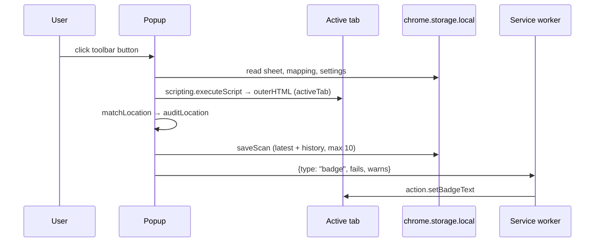

# Architecture

## One model for three sources

Every source is converted into the same `HoursModel` (`extension/lib/hours.js`):

```text
weekly[0..6]   Interval[] | null      Sunday … Saturday; [] = closed, null = source says nothing
overrides[]    { from, through, weekdays|null, intervals, source }   date-scoped rules
Interval       { start, end }         minutes after midnight of the day the set begins;
                                      end > 1440 for sets that run past midnight
```

`resolveDate(model, date)` returns the effective intervals for one calendar date: the union of all overrides covering the date (and its weekday, if the override lists weekdays), otherwise the weekly entry, otherwise `null`. Two dates are equal when their merged interval lists are identical to the minute.

| Source | Parser | Becomes |
|---|---|---|
| Business Profile spreadsheet | `gbp-sheet.js` | weekly from the per-day columns, one override per `Special hours` date; Google's `[UPDATED]` values kept separately in `location.googleUpdates` |
| LocalBusiness JSON-LD | `html.js` → `jsonld.js` | weekly from `dayOfWeek` specs (or, when there are none, from the text property `openingHours`), overrides from `validFrom`/`validThrough` specs in `openingHoursSpecification` and `specialOpeningHoursSpecification` |
| Visible text | `html.js` → `visible-hours.js` | weekly from "Mon–Fri 9–5"-style lines, overrides from dated lines (heuristic) |

### Where the vendors disagree

| Spelling | Business Profile spreadsheet | Google LocalBusiness JSON-LD |
|---|---|---|
| `00:00` to `00:00` | open 24 hours | closed all day |
| open 24 hours | `00:00-00:00`, `00:00-24:00`, `12:00AM-12:00AM` | opens `00:00`, closes `23:59` |
| closed | `x` or empty cell | opens `00:00`, closes `00:00` |
| past midnight | in the column of the day the set begins (`18:00-02:00`) | one spec with closes < opens |

Both parsers translate into the neutral model, so the comparison never sees the spellings. Each rule is pinned by a test that quotes the vendor sentence (`tests/vendor-semantics.test.js`).

## Audit (`audit.js`)

`auditLocation(location, page, { asOf, horizonDays })` returns:

- `checks[]` — `{ id, field, severity, message, detail }`, severities `fail | warn | info | pass`
- `calendar[]` — one entry per date with the three resolved interval lists and `schemaStatus` / `visibleStatus` (`match | drift | unknown`)
- `metrics` — `comparedDays`, `driftDays`, `visibleCompared`, `visibleDriftDays`
- `googleUpdates[]` — `{ field, profile, google, page, verdict }`, verdict `page-backs-google | page-backs-profile | page-silent | page-differs`
- `fixes` — `jsonLd` (`{ mode: 'patch'|'new', blockIndex, block, node, changes[], kept[] }`: the page's own block with the audited node patched, or a new block when the page has none) and `specialHours` (`{ cell, addedDates }`)

Check IDs: `SHEET_CELLS`, `LD_PARSE`, `LD_ENTITY`, `NAME_SCHEMA`, `NAME_VISIBLE`, `PHONE_SCHEMA`, `PHONE_VISIBLE`, `ADDRESS_SCHEMA`, `ADDRESS_VISIBLE`, `URL_PROFILE`, `URL_SCHEMA`, `HOURS_SCHEMA_ERRORS`, `HOURS_WEEKLY_SCHEMA`, `HOURS_SCHEMA_SOURCE`, `HOURS_WEEKLY_VISIBLE`, `SPECIAL_SCHEMA`, `SPECIAL_UNDECLARED`, `SPECIAL_VISIBLE`, `SCHEMA_EXPIRED`, `PAGE_CONSISTENCY`, `GOOGLE_UPDATES`, `GOOGLE_UPDATES_REJECT`, `GOOGLE_UPDATES_OPEN`.

When a page has several LocalBusiness entities, the one compared is the best match by phone (2 points), postal code (2), `url` (2) and name (1); ties go to the first in document order.

## The patch (`fixes.js`)

`patchLocalBusinessJsonLd` deep-copies the JSON-LD block that contains the audited node and substitutes that node (matched by object identity) with a copy in which only these keys change: `openingHoursSpecification` (rebuilt from the profile with all its future special dates, plus future dated rules that only the page declares; dated rules that already ended are dropped), `openingHours` and `specialOpeningHoursSpecification` (removed when present), `telephone` (only when `PHONE_SCHEMA` failed) and the `PostalAddress` parts reported as mismatched or missing. Every other key and every other node in the block is copied unchanged. The result lists `changes` in plain words and the `kept` keys, and a test re-audits the patched block to prove zero drift.

## Google updates triage

For each `[UPDATED]` value the audit asks one question: does the page agree with Google or with the owner? Hours are compared as resolved interval lists (weekday hours per weekday, special hours per date in the window), phones with the same normaliser as the NAP checks, URLs, names and postal codes with their normalisers. The page side is the JSON-LD when it has hours, otherwise the visible text.

## Runtime surfaces



The dashboard's batch scan asks for host access to the origins of all location pages inside the click handler (a Chrome requirement for `permissions.request`), then fetches two pages at a time and runs the same audit. Without the extension APIs the dashboard switches to demo mode: an in-memory store and the files in `examples/`.

## Storage keys

`sheet`, `mapping`, `settings`, `history:<store code>` (newest first, at most 10), `latest:<store code>`.

## Determinism

The audit never reads a clock: `asOf` is a parameter (the popup passes the local date, the CLI requires `--as-of`). Reports contain no timestamps, so `npm run demo` reproduces `examples/output/` byte for byte, which `tests/cli-and-demo.test.js` checks.
